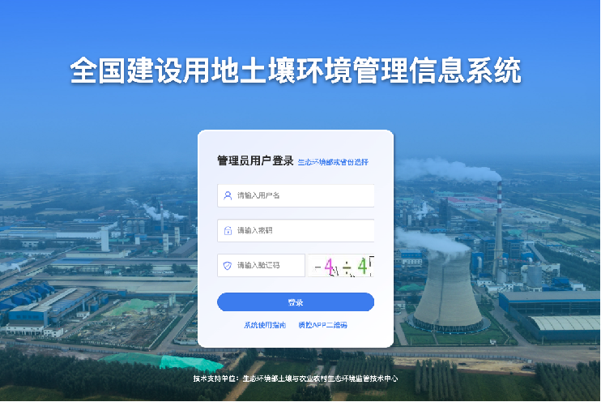
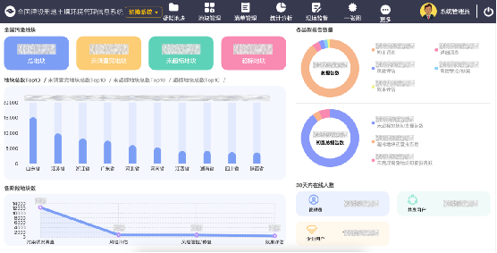
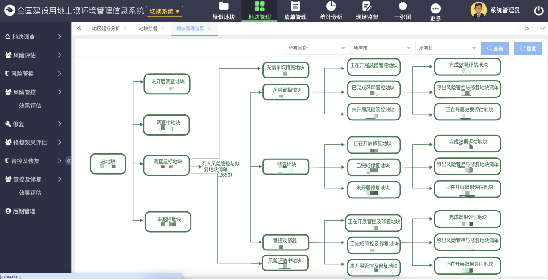
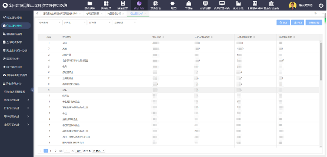
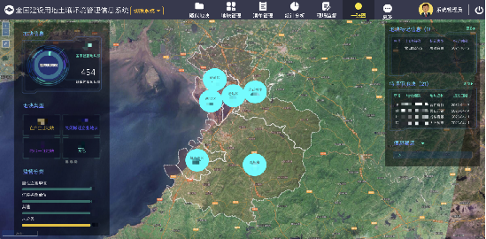

# 智慧环保-建设用地土壤环境管理系统（原污染地块管理系统）

#### 介绍
智慧环保-建设用地土壤环境管理系统（原污染地块管理系统）
系统简介：全国土壤环境信息化管理中最重要的信息平台，通过“地块调查”、“风险评估”、“管控修复”、“效果评估”、“后期管理”五大业务阶段构建完善的污染地块土壤环境管理业务体系，系统自2016年开始建设，2017年投入使用。目前系统管理着全国9万多地块，用户11万人以上。
使用部门：国家、省、市、县各级环保部门
主要成效：为部、省、市、县各级、各类开展污染地块土壤环境管理提供统一业务平台，全面提升了全国污染地块土壤环境管理水平。

商务合作 WeChat: 2609375767
#### 软件架构
软件架构说明

前端：vue

后台：spring-boot

#### 系统截图
1. 登录页

2.首页

3. 地块管理

4. 统计分析

5. 数据大屏

